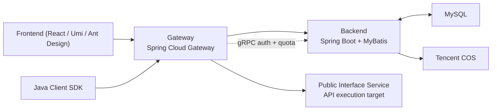

# Open API Platform

An API testing and management platform I designed and built end to end, with a microservices-style architecture and distributed request control.

This project started when I was working at my last company in China. The original goal was simple but important: help internal team members test APIs faster, more safely, and with less back-and-forth between frontend, backend, and QA. After proving the value internally, I redesigned the architecture to make the platform more open, more modular, and easier to extend for developers anywhere in the world.

What makes this project special to me is that I did not just build a CRUD dashboard. I designed the full architecture myself, including the gateway, backend services, SDK, gRPC communication, distributed quota control, and the user-facing management console.

## Why I Built It

In many teams, API testing is still surprisingly manual:

- people pass raw URLs around in chat
- signatures and auth headers are easy to get wrong
- quota and invoke tracking are disconnected from the gateway
- internal APIs are hard to expose safely to a broader audience

I built Open API Platform to solve that in a structured way:

- provide a clean interface catalog
- let users test APIs through a unified entrypoint
- centralize authentication and request verification
- control per-user invoke quotas
- give admins visibility into interface usage
- package the invocation logic into an SDK so consumers do not need to rebuild signing logic themselves

## Project Highlights

- Designed a microservices-style multi-module architecture instead of a monolith, separating gateway, management backend, public interface service, SDK, and shared RPC contract.
- Built a gRPC-based auth and quota pipeline between gateway and backend, so the gateway does not depend on hardcoded credentials.
- Implemented reserve / commit / rollback quota control to avoid over-consuming invoke counts under concurrent access.
- Designed a distributed request path where auth, routing, quota, and execution are handled by different services with clear responsibilities.
- Added a reusable Java client SDK so downstream consumers can call platform APIs with consistent signing, timeout handling, and error boundaries.
- Built a React + Ant Design management console for login, interface management, invoke analysis, and admin operations.
- Added file upload support for user avatars and profile assets.
- Reworked the project branding and developer experience to make it suitable as a public-facing portfolio project.

## Architecture



### Module Breakdown

- `openapi-frontend`
  - React + Umi management console
  - login/register, admin pages, interface analysis, profile/avatar flow

- `openapi-gateway`
  - unified traffic entrypoint
  - routes `/api/name/**` to the public interface service
  - routes management APIs to the backend
  - verifies signatures before forwarding requests
  - checks quota before invocation and finalizes it after response completion

- `openapi-backend`
  - core management system
  - user management, interface management, quota data, analysis APIs, file upload
  - hosts the gRPC services used by the gateway

- `openapi-public-interface`
  - real API execution service
  - receives traffic forwarded by the gateway

- `openapi-client-sdk`
  - reusable Java SDK for calling platform APIs
  - wraps signing, request building, and error handling

- `openapi-auth-rpc`
  - shared gRPC contract module
  - keeps gateway and backend on the same RPC request/response definitions

## Microservices and Distributed System Perspective

I describe this project as a microservices-style platform because different parts of the request lifecycle are intentionally separated:

- the frontend handles management and visibility
- the gateway owns routing, verification, and traffic control
- the backend owns business data, auth truth, quota state, and analysis
- the public interface service owns real API execution
- the SDK acts as a consumer-facing integration layer

From a distributed-system point of view, the interesting part is not just "multiple services exist". The important part is how they cooperate safely:

- the gateway does not keep auth secrets locally and instead asks the backend through gRPC
- quota is reserved before execution and finalized after execution, which is safer than naive counter updates
- the protobuf contract is shared to reduce cross-service drift
- failures are translated cleanly across layers: backend exception -> gRPC error -> gateway HTTP response
- service boundaries are explicit, so responsibilities stay clear as the system grows

## Engineering Decisions I’m Proud Of

### 1. Gateway auth backed by gRPC, not hardcoded secrets

The gateway receives `accessKey`, `nonce`, `timestamp`, `body`, and `sign` from the caller.  
Instead of storing secrets inside the gateway, it asks the backend through gRPC for the user’s auth info. That keeps the backend as the source of truth and makes the gateway safer and easier to evolve.

### 2. Quota control with reserve / commit / rollback

I did not want invoke counting to be “best effort”.

So the gateway:

1. reserves quota before forwarding the request
2. forwards the request to the public interface
3. commits quota on success
4. rolls it back on downstream failure

This design is much more reliable than simply incrementing counters after the fact, especially under concurrency.

It is also one of the clearest distributed-system decisions in the project, because it treats cross-service request completion as a state transition problem instead of a simple database update.

### 3. Shared RPC contract for cross-service consistency

I split the gRPC protobuf contract into its own Maven module so backend and gateway share the same generated classes. This prevents DTO drift and keeps service contracts explicit.

### 4. SDK as a product, not just a helper

I built a dedicated client SDK so users of the platform do not have to handcraft signatures or HTTP calls every time. This turns the platform from “an internal tool” into “something other developers can integrate with”.

## Core Features

- User login, registration, logout, and profile management
- Default avatar support and avatar upload
- Interface catalog and interface lifecycle management
- Online/offline interface status control
- Gateway-based API forwarding
- Signature verification with `accessKey` / `secretKey`
- Per-user interface quota management
- Invoke analytics for top-used interfaces
- Java SDK for simplified API invocation
- gRPC service communication between gateway and backend

## Typical Request Flow

1. A client or SDK sends a signed request to the gateway.
2. The gateway validates timestamp, nonce, and request headers.
3. The gateway calls backend gRPC to look up the user by `accessKey`.
4. The gateway recomputes the signature with the backend-provided `secretKey`.
5. The gateway asks backend gRPC to reserve invoke quota.
6. If quota is available, the gateway forwards the request to the public interface service.
7. On success, quota is committed.
8. On failure, quota is rolled back.

This is one of the parts I like most in interviews because it shows distributed system thinking, not just page-building.

## Tech Stack

### Backend

- Java 8 / 17 / 21 across modules
- Spring Boot
- Spring Cloud Gateway
- MyBatis + MyBatis-Plus
- gRPC
- MySQL
- Redis / Spring Session support
- Tencent COS
- Knife4j / OpenAPI docs

### Frontend

- React
- Umi Max
- Ant Design
- Ant Design Pro Components
- TypeScript
- ECharts

## Local Development

### Default Ports

- Frontend: Umi dev server
- Gateway: `8283`
- Backend: `8101`
- Backend gRPC: `9091`
- Public interface service: `8123`

### Backend Setup

1. Configure MySQL in [application.yml](/Users/wangyupeng/githubProject/openAPI/openapi-backend/src/main/resources/application.yml).
2. Run:
   - [01_create_current_tables.sql](/Users/wangyupeng/githubProject/openAPI/openapi-backend/sql/01_create_current_tables.sql)
   - [02_insert_sample_data.sql](/Users/wangyupeng/githubProject/openAPI/openapi-backend/sql/02_insert_sample_data.sql)
3. Start `openapi-auth-rpc`, `openapi-backend`, `openapi-gateway`, and `openapi-public-interface` as needed.

### Sample Accounts

- Admin: `admin_demo`
- Demo user: `demo_user`
- Password: `12345678`

### Frontend Setup

```bash
cd /Users/wangyupeng/githubProject/openAPI/openapi-frontend
npm install
npm run start:dev
```

### Workspace Build

```bash
cd /Users/wangyupeng/githubProject/openAPI
mvn clean install -DskipTests
```

## Interview Talking Points

If I were introducing this project in an interview, I would focus on these points:

- I identified a real internal productivity problem and built a platform around it.
- I designed the architecture myself instead of only implementing assigned tickets.
- I separated management, traffic routing, API execution, SDK, and service contract concerns into dedicated services/modules.
- I used gRPC where low-latency backend-to-gateway communication made sense, instead of coupling everything through direct database access.
- I thought about distributed correctness under failure by adding quota reserve / commit / rollback.
- I can explain the full request path across multiple services, including auth lookup, signature verification, quota reservation, forwarding, and final state reconciliation.
- I turned an internal company tool into a more polished public-facing product.

## What I Would Improve Next

- Add automated integration tests for the full gateway -> gRPC -> public interface flow
- Add observability dashboards and request tracing
- Add stronger tenant / organization support
- Add rate limiting and richer API publishing workflows
- Add Docker Compose for one-command local startup

## Personal Note

This project means a lot to me because it reflects how I think as an engineer:

- start from a real problem
- design the system, not just the page
- care about correctness, maintainability, and developer experience
- keep improving the product beyond the first internal version

I originally built it to help my teammates.  
Now I’m proud to show it as a project that represents my architecture thinking, backend depth, and product ownership.
