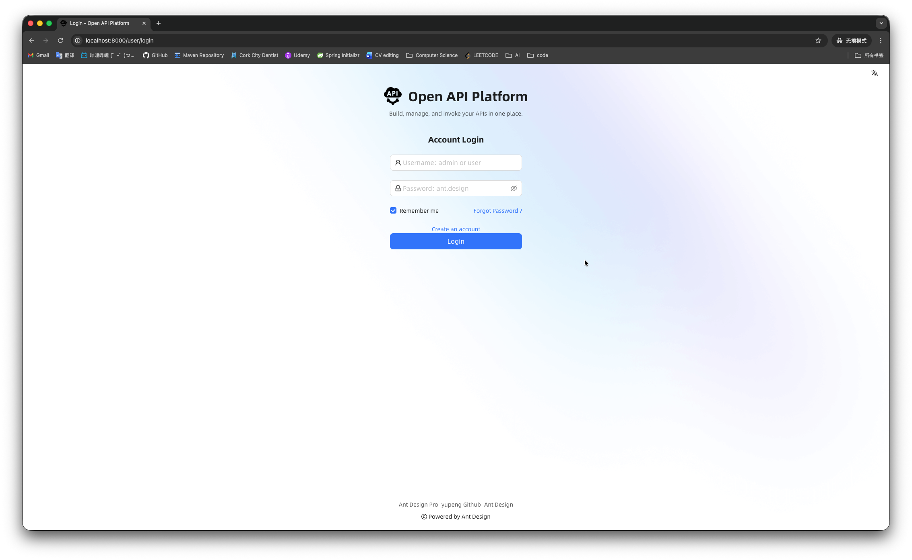
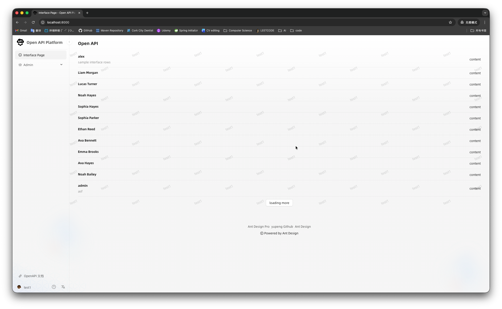
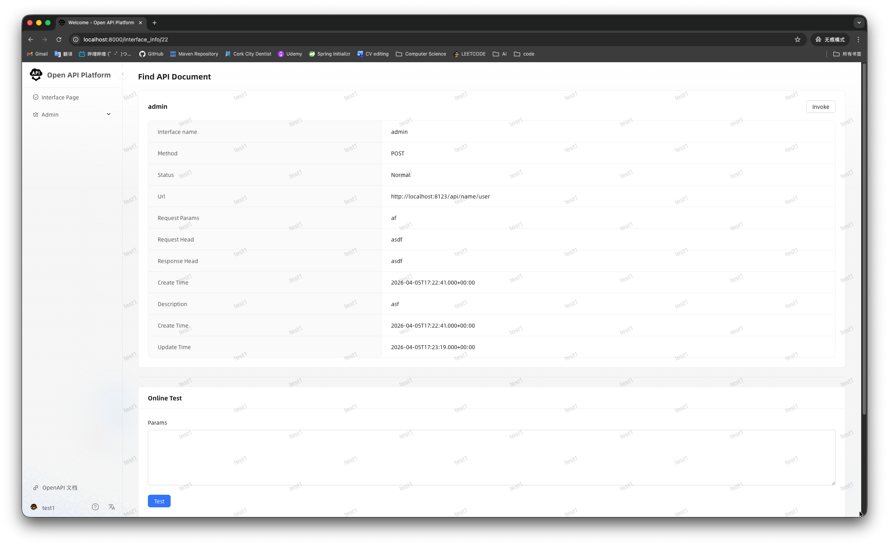
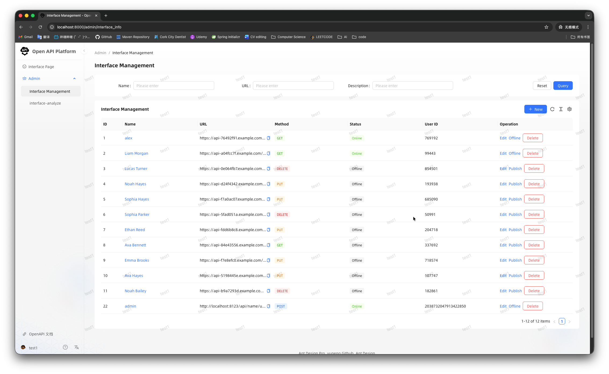
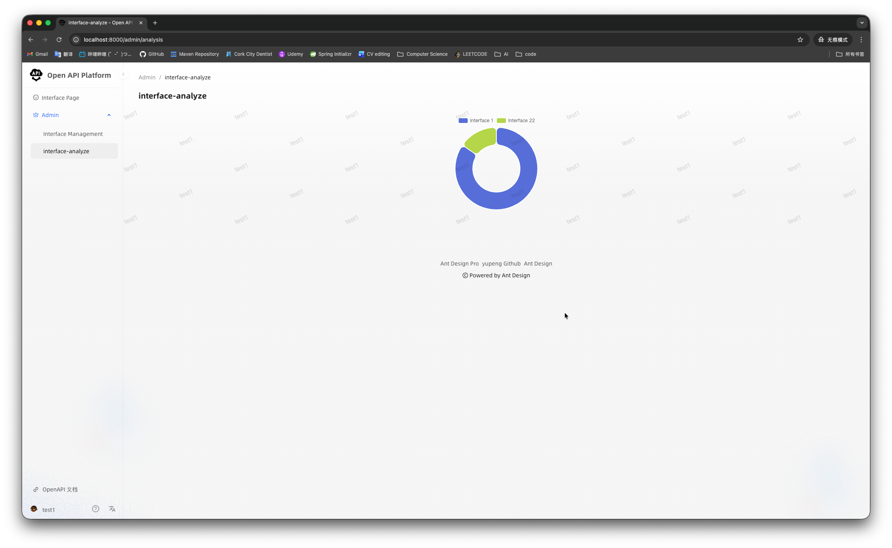
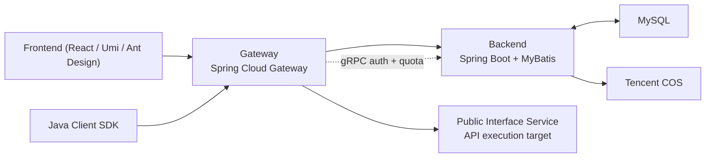

# Open API Platform

An end-to-end API management and invocation platform that combines a React admin console, a Spring Cloud Gateway traffic layer, backend management services, a public interface service, and a reusable Java SDK.

I originally built this project to solve a real internal team problem: API testing and sharing were too manual, too error-prone, and too fragmented across frontend, backend, and QA. I later redesigned it into a more modular, public-facing platform that demonstrates system design, distributed request control, and product thinking, not just dashboard CRUD.

## Table of Contents

- [Project Overview](#project-overview)
- [Product Walkthrough](#product-walkthrough)
- [Core Features](#core-features)
- [Architecture](#architecture)
- [Module Breakdown](#module-breakdown)
- [Typical Request Flow](#typical-request-flow)
- [Engineering Decisions](#engineering-decisions)
- [Tech Stack](#tech-stack)
- [Local Development](#local-development)
- [Interview Talking Points](#interview-talking-points)
- [What I Would Improve Next](#what-i-would-improve-next)

## Project Overview

Open API Platform is designed to make API publishing, testing, invocation, and quota management easier for both internal teams and external developers.

Instead of passing raw URLs around and manually rebuilding signatures for every request, the platform provides:

- a central API catalog for discovery
- a management console for admins and users
- a unified gateway for routing and verification
- backend-controlled authentication and quota management
- a Java SDK that hides signing and request-building complexity
- analysis pages for monitoring interface usage

This is the kind of project I like building most: one grounded in a practical workflow problem, but implemented with enough architectural depth to show backend engineering and distributed-system thinking.

## Product Walkthrough

The screenshots below show the platform from login through interface discovery, admin management, online testing, and usage analysis.

### 1. Login Experience

The platform starts with a clean branded login page. This screen is intentionally simple so users can get into the system quickly without friction.



What this screen demonstrates:

- a dedicated platform identity instead of a generic scaffold
- a focused authentication flow for admin and user accounts
- a polished first-touch experience for portfolio and demo use

### 2. Interface Catalog

After login, users can browse the available API interfaces through a unified catalog page. This page acts as the discovery layer for consumers who want to inspect what APIs are available before invoking them.



What this page demonstrates:

- centralized interface discovery
- a simple list-based browsing experience
- the consumer-facing side of the platform

### 3. API Detail and Online Test Page

Each interface has a dedicated detail page where users can inspect metadata and perform online testing. This helps bridge the gap between API documentation and actual invocation.



What this page demonstrates:

- interface metadata display
- inline testing workflow
- a smoother developer experience than manually constructing requests outside the platform

### 4. Admin Interface Management

Admins can manage interface records from a dedicated management page. This includes listing interfaces, reviewing their status, and performing operations such as editing, publishing, taking offline, and deleting.



What this page demonstrates:

- admin-side interface lifecycle management
- interface status control
- the operational side of the platform, not just the consumer UI

### 5. Usage Analysis

The analysis page visualizes interface invocation distribution so admins can quickly understand which APIs are seeing the most traffic.



What this page demonstrates:

- basic operational analytics
- interface-level visibility
- how the platform supports both execution and management feedback loops

## Core Features

- User login, registration, logout, and profile management
- Interface catalog for browsing published APIs
- Online API detail and testing page
- Admin interface management with status control
- Gateway-based request forwarding
- Signature verification using `accessKey` and `secretKey`
- Per-user invoke quota management
- Usage analysis for top-invoked interfaces
- Java SDK for easier downstream integration
- gRPC communication between gateway and backend services
- File upload support for avatars and profile assets

## Architecture



This architecture separates management, routing, execution, and integration concerns into dedicated modules. That separation is what makes the project more than a single admin dashboard.

## Module Breakdown

### `openapi-frontend`

- React + Umi management console
- login, user flows, interface pages, admin pages, analysis dashboard

### `openapi-gateway`

- unified traffic entry point
- validates request metadata and signatures
- forwards requests to downstream services
- coordinates quota lifecycle around invocation

### `openapi-backend`

- core business system
- user, interface, quota, and analysis management
- gRPC provider for gateway auth and quota checks
- file upload support

### `openapi-public-interface`

- actual API execution target
- receives forwarded calls from the gateway

### `openapi-client-sdk`

- reusable Java SDK
- wraps signing and request-building logic
- reduces repeated integration effort for API consumers

### `openapi-auth-rpc`

- shared protobuf and gRPC contract module
- keeps gateway and backend service communication consistent

## Typical Request Flow

1. A client application or the Java SDK sends a signed request to the gateway.
2. The gateway validates required headers such as `accessKey`, `nonce`, `timestamp`, `body`, and `sign`.
3. The gateway calls backend gRPC to look up the caller by `accessKey`.
4. The gateway recomputes the signature using the backend-provided `secretKey`.
5. The gateway asks the backend to reserve invoke quota.
6. If quota is available, the request is forwarded to the public interface service.
7. On success, the invoke count is committed.
8. On failure, the quota reservation is rolled back.

This flow is one of the strongest parts of the project because it shows how service boundaries, authentication, and quota control work together across modules.

## Engineering Decisions

### 1. gRPC-backed gateway authentication

The gateway does not store hardcoded auth truth locally. Instead, it delegates user credential lookup to the backend through gRPC. This keeps the backend as the source of truth and reduces coupling in the traffic layer.

### 2. Reserve / commit / rollback quota control

Instead of treating invoke counting as a best-effort afterthought, the project models it as a state transition:

1. reserve quota before execution
2. commit on success
3. rollback on failure

This is safer than naive counter updates and better reflects real distributed failure handling.

### 3. Shared RPC contract module

The protobuf contract lives in its own Maven module so the backend and gateway share the same generated types. This reduces drift and keeps cross-service contracts explicit.

### 4. SDK as part of the product

The Java SDK is not just a convenience helper. It is part of the platform design. It turns invocation from a manual request-building exercise into a cleaner consumer integration experience.

## Tech Stack

### Backend

- Java 8 / 17 / 21 across different modules
- Spring Boot
- Spring Cloud Gateway
- MyBatis and MyBatis-Plus
- gRPC
- MySQL
- Redis and Spring Session support
- Tencent COS
- Knife4j / OpenAPI documentation tooling

### Frontend

- React
- Umi Max
- Ant Design
- Ant Design Pro Components
- TypeScript
- ECharts

## Local Development

### Default Ports

- Frontend: Umi development server
- Gateway: `8283`
- Backend: `8101`
- Backend gRPC: `9091`
- Public interface service: `8123`

### Backend Setup

1. Configure MySQL in [`openapi-backend/src/main/resources/application.yml`](openapi-backend/src/main/resources/application.yml).
2. Run the SQL initialization scripts:
   - [`openapi-backend/sql/01_create_current_tables.sql`](openapi-backend/sql/01_create_current_tables.sql)
   - [`openapi-backend/sql/02_insert_sample_data.sql`](openapi-backend/sql/02_insert_sample_data.sql)
3. Start the required backend modules:
   - `openapi-auth-rpc`
   - `openapi-backend`
   - `openapi-gateway`
   - `openapi-public-interface`

### Frontend Setup

```bash
cd openapi-frontend
npm install
npm run start:dev
```

### Workspace Build

```bash
mvn clean install -DskipTests
```

### Sample Accounts

- Admin: `admin_demo`
- Demo user: `demo_user`
- Password: `12345678`

## Interview Talking Points

- I identified a real team workflow problem and turned it into a complete platform.
- I designed the architecture across gateway, backend, SDK, and public interface layers instead of only building individual pages.
- I used gRPC where service-to-service communication benefits from a strongly typed, low-latency contract.
- I modeled quota handling as a distributed state transition problem rather than a basic counter increment.
- I can explain the full request path from frontend or SDK, through gateway verification, backend auth lookup, quota reservation, forwarding, and result finalization.
- I built both product-facing UI and deeper backend infrastructure, which shows breadth as well as depth.

## What I Would Improve Next

- Add end-to-end integration tests for the full gateway -> gRPC -> public interface flow
- Add request tracing and observability dashboards
- Add stronger tenant and organization support
- Add richer API publishing workflows
- Add Docker Compose for one-command local startup
- Expand analytics beyond the current top-invocation view

## Personal Note

This project represents how I like to work as an engineer:

- start from a real operational problem
- design the system, not just the screen
- care about correctness and developer experience together
- keep improving a useful internal tool until it becomes something worth showcasing publicly

It began as something to help teammates move faster. It has since become one of the best examples of my system design, backend engineering, and product ownership.
